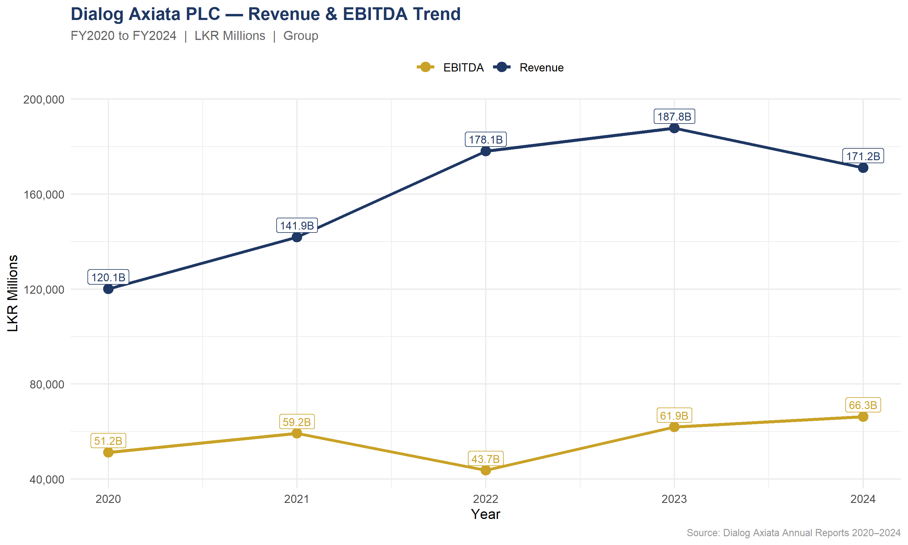
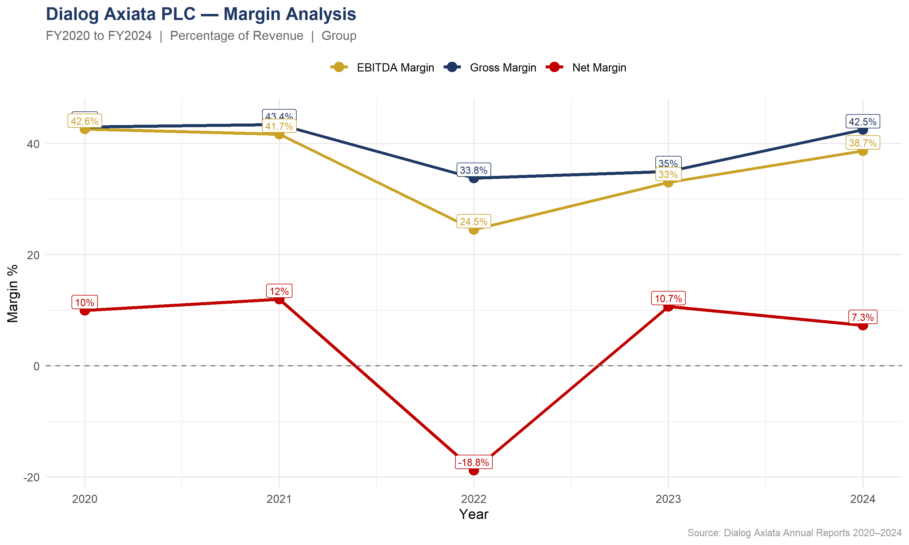
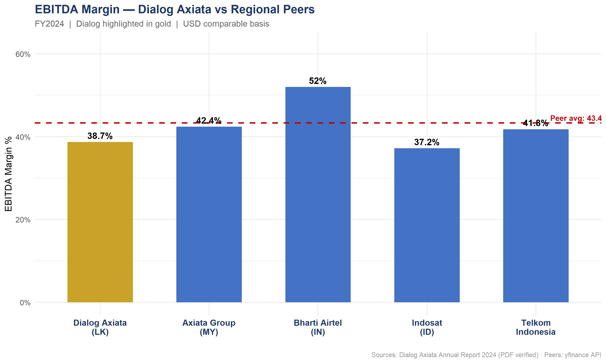
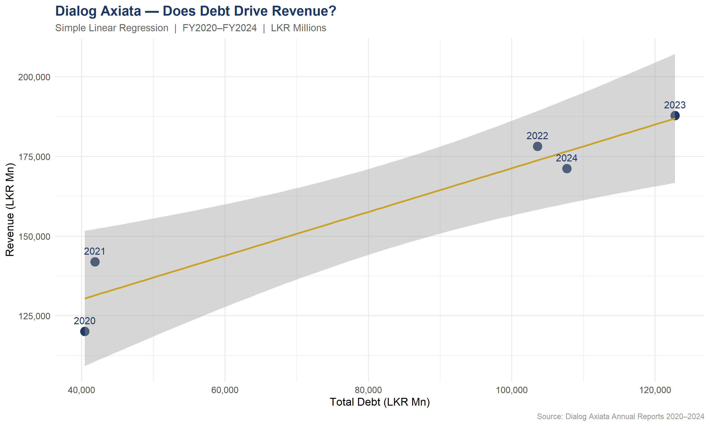

# Dialog Axiata PLC — Financial Due Diligence Analysis
 

**Tools:** Excel · Python · R · PowerPoint  

**Note:** All competitor data automated via Python — 
replacing 2 days of manual research with a 60-second script.

---

## Executive Summary
Dialog Axiata PLC is Sri Lanka's largest listed telecom with LKR 171.2Bn
revenue in FY2024. This analysis evaluates Dialog as a PE acquisition
target across 5 years of financials, regional competitor benchmarking,
DCF valuation under 3 scenarios, and regression analysis.

**Verdict: CAUTIOUS BUY.** Dialog trades at a P/E of 5.62x vs peer
average of 24x, carries the lowest debt in its peer group at 1.38x
Debt/Equity, and has a clear margin improvement pathway of 4% to reach
peer average EBITDA margins.

---

## Business Scenario
A Private Equity firm is evaluating the acquisition of Dialog Axiata PLC,
Sri Lanka's largest listed telecom. As the analyst, I produced the full
financial and market analysis pack used to support the investment decision.

---

## What I Built

| Deliverable | Tool | Description |
|---|---|---|
| Financial Model | Excel | 5-sheet model — Income Statement, Ratio Analysis, DCF Valuation, Revenue Waterfall |
| Competitor Benchmarking | Python | Live data from 5 regional peers via yfinance API, FX-adjusted to USD |
| Visual Analysis | R + ggplot2 | 4 publication-quality charts including regression analysis |
| Due Diligence Report | PowerPoint | 10-slide consulting-grade deliverable |

---

## Investment Recommendation
**CAUTIOUS BUY** — Dialog Axiata presents a compelling acquisition
profile: undervalued relative to peers, minimal leverage, and an
identifiable margin improvement pathway. Entry recommended contingent
on macro stability and post-2024 revenue recovery confirmation.

---
## Charts

  

  

---
## Key Findings

**Finding 1 — Dialog is undervalued**  
P/E of 5.62x vs regional peer average of 24x. Significant price upside
for a PE acquirer relative to comparable listed telecoms.

**Finding 2 — Safest balance sheet in the peer group**  
Debt/Equity of 1.38x vs peer average of 75.52x. Dialog carries minimal
leverage — acquisition financing risk is low.

**Finding 3 — Margin gap is an opportunity**  
EBITDA margin of 38.7% sits 4% below peer average. For a PE firm this
is an operational improvement target that could unlock significant
post-acquisition value.

---

## 2022 Analyst Note
Dialog posted a net loss of LKR 33,409 Mn in 2022. This was driven
entirely by LKR 30,280 Mn in net foreign exchange losses caused by
the Sri Lankan rupee collapse — not operational underperformance.
EBITDA remained positive at LKR 43,663 Mn confirming core business
health throughout the crisis.

---

## Data Sources
All Dialog financials extracted manually from official annual reports
(PDF verified, 2020–2024). Competitor data via yfinance API with
FX conversion using 2024 average rates (World Bank / XE.com).

---

## Repository Structure

| File | Description |
|---|---|
| `competitor_analysis.py` | Python competitor benchmarking script |
| `dialog_charts.R` | R script — 4 ggplot2 charts |
| `model/Dialog_Axiata_Financial_Model.xlsx` | Full Excel financial model |
| `data/competitor_benchmarking.xlsx` | Peer comparison output |
| `report/Dialog_Axiata_Due_Diligence_FINAL.pptx` | 10-slide consulting report |
| `charts/chart1_revenue_ebitda_trend.png` | Revenue & EBITDA trend 2020-2024 |
| `charts/chart2_margin_analysis.png` | Gross / EBITDA / Net margin analysis |
| `charts/chart3_competitor_ebitda.png` | Dialog vs regional peer EBITDA margins |
| `charts/chart4_regression.png` | Regression — Does debt drive revenue? |

## Author
**Kavindi Gamage**  
[LinkedIn](https://www.linkedin.com/in/kavindi-gamage-815049386)

*Built April 2025 · All data PDF-verified from official annual reports*

## License
© 2025 Kavindi Gamage. All rights reserved.
This project is licensed under [CC BY-NC-ND 4.0](https://creativecommons.org/licenses/by-nc-nd/4.0/) — viewing only. No reuse, reproduction, or derivative works permitted without explicit written permission.
